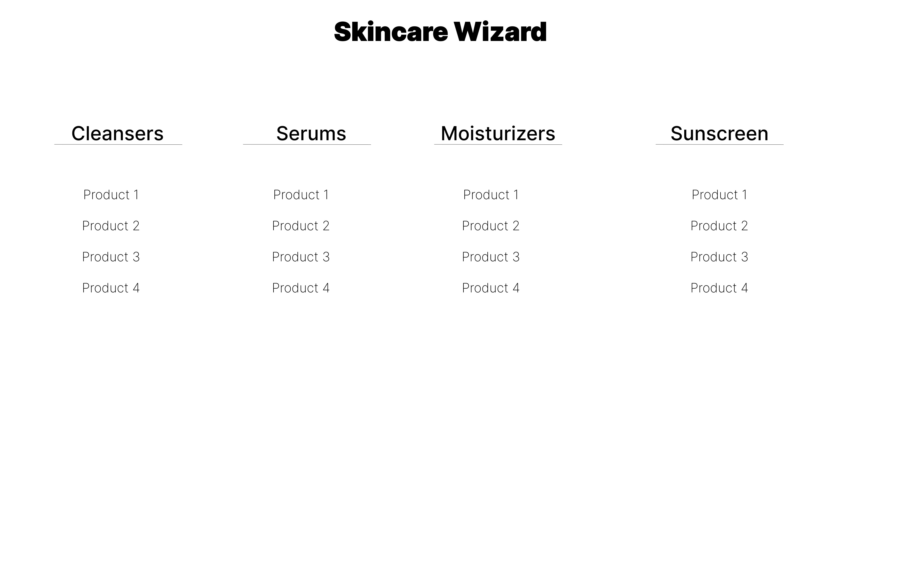
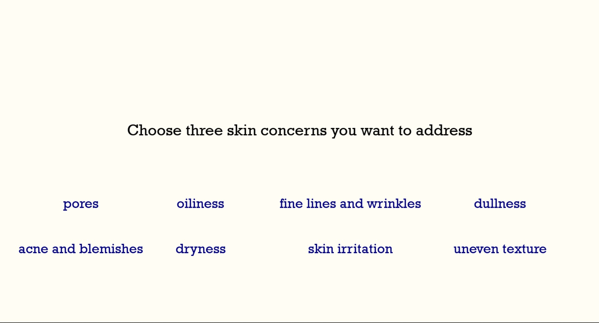

# Skincare Genie
## CS110 Final Project - Spring, 2024 

## Team Members

Arlene Shaji

***

## Project Description

The program asks the users about their main skin concerns and skin type and generates product suggestions based on this information. The users can choose products to add to their final routine using the ingredient and price information displayed. 

***    

## GUI Design

### Initial Design

### Final Design

## Program Design

### Features

1. Reads json file containing potential skincare suggestions and their corresponding skin concerns and skin types
2. Personalizes products to skin concerns and skin types 
3. Images for each product 
4. Pop up boxes when hovering over images showing ingredients
5. Allows users to choose their own products 
6. Final screen showing all chosen products and gives option to restart

### Classes

- Skincare_Genie - controller class that handles events and runs the actual program
- Button - creates the clickable buttons for answers to prompts and selecting products
- Hover - draws and organizes text in the pop up boxes and checks if the mouse is hovering over an image
- View - draws text for display on the interface

## ATP
 
 ### Program Launch
 #### Description:
 Ensure that the program is launched correctly and the welcome message is shown. 
 #### Procedure: 
* Step 1: Open terminal and go to main folder
* Step 2: Type in: python main.py
 #### Expected Results:
 Program is launched and the title is displayed as "Welcome to  Skincare Genie" and appears for 2 seconds. 

 ### Skin Concern Selection
 #### Description:
 Verify that the skin concern choices are recognized and the next screen is shown. 
 #### Procedure: 
* Step 1: From the presented list of skin concerns, click on acne and blemishes, pores, and oiliness
* Step 2: Verify the screen moves to the skin types screen.
 #### Expected Results:
The screen moves to the next screen after the third concern is clicked.
 
 ### Skin Type Selection
 #### Description:
 Verify that the skin type choice is recognized and the next screen is shown.
 #### Procedure: 
* Step 1: From the presented list of skin types, click on sensitive from the list.
* Step 2: Verify the screen moves to the oil cleansers screen.
 #### Expected Results:
The screen moves to the next screen after the type is clicked.
 
 ### Product Selection
 #### Description:
 Ensure the mouse hovering and clicking are detected as expected. 
 #### Procedure: 
* Step 1: Hover over the image of Anua Oil Cleanser.
* Step 2: Hover over the image of Kose Oil Cleanser.
* Step 3: Verify that each hover box displays unique information. 
* Step 3: Click on the Anua Cleanser from the list.
* Step 4: Verify that the screen moves to the cleanser screen. 
* Step 4: Repeat for every product screen, selecting Youth to the People cleanser, Tower 28 toner, SKIN 1004 serum, Dr. G moisturizer, and SKIN 1004 sunscreen. 
 #### Expected Results:
The hover boxes display ingredients specified for each product when the image is hovered over and when the text is selected, the next product screen is shown. 
 
 ### Final Routine
 #### Description:
 Ensure the choices have been recorded and are displayed as expected. 
 #### Procedure: 
* Step 1: Verify that the chosen products are present with images, names, and prices
* Step 2: Hover over the images. 
* Step 3: Verify that the ingredients are still shown and are unique to the suggestion.
 #### Expected Results:
 The products chosen during the product selection test should be shown with unique ingredients in the hover boxes. 

 ### Exit Button
 #### Description:
 Verify the mouse click is registered and the program exits. 
 #### Procedure: 
* Step 1: Click on the exit button at the bottom of the screen. 
* Step 2: Check that the application closes. 
 #### Expected Results:
 The program closes when the exit button is clicked. 

 ### Return to Start Button
 #### Description:
 Verify that the button click is registered and the program starts again. 
 #### Procedure: 
* Step 1: Select the "Return to Start" button.
* Step 2: Check that the program starts again. 
* Step 3: Choose three new concerns: fine lines and wrinkles, dullness, and uneven texture.
* Step 4: Choose a new skin type: combination. 
* Step 5: Verify that suggestions given are not the same as the first round. 
 #### Expected Results:
 The return to start button sends the user to another welcome screen. A new set of suggestions is shown based on the new concerns and skin type selected. 

